```mermaid
sequenceDiagram
    participant User
    participant LIFF as LINE LIFF App
    participant Backend
    participant LINE as LINE Platform
    participant DB as Database
    
    User->>LIFF: เปิด LIFF App
    LIFF->>LINE: liff.init()
    LINE-->>LIFF: LIFF Ready
    LIFF->>LINE: liff.getProfile()
    LINE-->>LIFF: User Profile (userId, displayName, pictureUrl)
    LIFF->>LINE: liff.getIDToken()
    LINE-->>LIFF: ID Token
    LIFF->>Backend: POST /api/line/auth {idToken, profile}
    Backend->>LINE: Verify ID Token
    LINE-->>Backend: Token Valid
    Backend->>DB: Create/Update User
    DB-->>Backend: User Data
    Backend-->>LIFF: JWT Token + User Data
    LIFF->>LIFF: Store JWT in localStorage
    User->>LIFF: ใช้งาน App
```

```mermaid
sequenceDiagram
    participant User
    participant Frontend
    participant Backend
    participant Omise as Omise API
    participant Webhook
    participant DB as Database
    
    User->>Frontend: Checkout (amount: 500 THB)
    Frontend->>Backend: POST /api/payments/omise/promptpay
    Backend->>Omise: Create Source (type: promptpay)
    Omise-->>Backend: Source ID + QR Code URL
    Backend->>Omise: Create Charge (source + amount)
    Omise-->>Backend: Charge ID + Status: pending
    Backend->>DB: Save Order (status: pending)
    Backend-->>Frontend: QR Code URL + Charge ID
    Frontend->>User: แสดง QR Code
    User->>User: Scan & Pay via Banking App
    Omise->>Webhook: POST /api/payments/omise/webhook
    Note over Webhook: Event: charge.complete
    Webhook->>DB: Update Order (isPaid: true)
    Webhook->>Omise: HTTP 200 OK
    Frontend->>Backend: Poll /api/payments/omise/status/:chargeId
    Backend-->>Frontend: Status: successful
    Frontend->>User: แสดงยืนยันการชำระเงิน
```

# 🔌 Integration Workflow Template
## LINE LIFF + Admin + Omise Payment Gateway

คู่มือนี้เป็น Template สำหรับนำไปใช้กับ App อื่น โดยครอบคลุม:
1. **LINE LIFF Authentication** - ระบบสมาชิกผ่าน LINE
2. **Admin Authentication** - ระบบ Admin Panel
3. **Omise Payment Gateway** - ระบบชำระเงิน PromptPay

---

## 📐 Architecture Overview


---

## 1️⃣ LINE LIFF Authentication

### Flow Diagram



### Environment Variables

```env
# LINE Login Channel
LINE_CHANNEL_ID=your-line-channel-id
LINE_CHANNEL_SECRET=your-line-channel-secret

# LINE Messaging API (for Bot)
LINE_CHANNEL_ACCESS_TOKEN=your-channel-access-token

# LIFF App
LIFF_ID=your-liff-id
```

### Frontend Code (LIFF)

```javascript
// liff-app.js
const LIFF_ID = 'YOUR_LIFF_ID';
const API_URL = 'https://your-api.com';

async function initializeLiff() {
    try {
        await liff.init({ liffId: LIFF_ID });
        
        if (!liff.isLoggedIn()) {
            liff.login();
            return;
        }
        
        // Get user profile
        const profile = await liff.getProfile();
        const idToken = liff.getIDToken();
        
        // Authenticate with backend
        const response = await fetch(`${API_URL}/api/line/auth`, {
            method: 'POST',
            headers: { 'Content-Type': 'application/json' },
            body: JSON.stringify({
                idToken: idToken,
                profile: {
                    lineUserId: profile.userId,
                    displayName: profile.displayName,
                    pictureUrl: profile.pictureUrl,
                    statusMessage: profile.statusMessage
                }
            })
        });
        
        const data = await response.json();
        
        if (data.success) {
            localStorage.setItem('token', data.token);
            localStorage.setItem('user', JSON.stringify(data.user));
        }
    } catch (error) {
        console.error('LIFF init error:', error);
    }
}
```

### Backend Code (LINE Auth)

```javascript
// controllers/lineAuthController.js
const jwt = require('jsonwebtoken');
const axios = require('axios');
const User = require('../models/User');

exports.authenticateLine = async (req, res) => {
    try {
        const { idToken, profile } = req.body;
        
        // Verify ID Token with LINE
        const verifyResponse = await axios.post(
            'https://api.line.me/oauth2/v2.1/verify',
            `id_token=${idToken}&client_id=${process.env.LINE_CHANNEL_ID}`,
            { headers: { 'Content-Type': 'application/x-www-form-urlencoded' } }
        );
        
        if (verifyResponse.data.sub !== profile.lineUserId) {
            return res.status(401).json({ 
                success: false, 
                message: 'Invalid token' 
            });
        }
        
        // Find or create user
        let user = await User.findOne({ 
            'lineProfile.lineUserId': profile.lineUserId 
        });
        
        if (!user) {
            user = await User.create({
                lineProfile: {
                    lineUserId: profile.lineUserId,
                    displayName: profile.displayName,
                    pictureUrl: profile.pictureUrl
                },
                authProvider: 'line',
                role: 'customer'
            });
        } else {
            // Update profile
            user.lineProfile = profile;
            await user.save();
        }
        
        // Generate JWT
        const token = jwt.sign(
            { id: user._id, role: user.role },
            process.env.JWT_SECRET,
            { expiresIn: process.env.JWT_EXPIRE }
        );
        
        res.status(200).json({
            success: true,
            token,
            user: {
                id: user._id,
                displayName: user.lineProfile.displayName,
                pictureUrl: user.lineProfile.pictureUrl,
                role: user.role
            }
        });
    } catch (error) {
        res.status(500).json({ 
            success: false, 
            message: error.message 
        });
    }
};
```

---

## 2️⃣ Admin Authentication

### Flow Diagram



```mermaid
sequenceDiagram
    participant Admin
    participant Frontend as Admin Panel
    participant Backend
    participant DB as Database
    
    Admin->>Frontend: เปิด Admin Panel
    Frontend->>Admin: แสดง Login Form
    Admin->>Frontend: กรอก Email/Password
    Frontend->>Backend: POST /api/auth/login
    Backend->>DB: Find User by Email
    DB-->>Backend: User Data + Hashed Password
    Backend->>Backend: bcrypt.compare(password)
    Backend->>Backend: Check role === 'admin'
    Backend-->>Frontend: JWT Token (with admin role)
    Frontend->>Frontend: Store JWT
    Frontend->>Admin: Redirect to Dashboard
```

### Backend Code (Admin Auth)

```javascript
// controllers/authController.js
const bcrypt = require('bcryptjs');
const jwt = require('jsonwebtoken');
const User = require('../models/User');

exports.login = async (req, res) => {
    try {
        const { email, password } = req.body;
        
        // Find user with password field
        const user = await User.findOne({ email }).select('+password');
        
        if (!user) {
            return res.status(401).json({
                status: 'error',
                message: 'อีเมลหรือรหัสผ่านไม่ถูกต้อง'
            });
        }
        
        // Verify password
        const isMatch = await bcrypt.compare(password, user.password);
        
        if (!isMatch) {
            return res.status(401).json({
                status: 'error',
                message: 'อีเมลหรือรหัสผ่านไม่ถูกต้อง'
            });
        }
        
        // Check if account is active
        if (!user.isActive) {
            return res.status(403).json({
                status: 'error',
                message: 'บัญชีถูกระงับ'
            });
        }
        
        // Generate JWT
        const token = jwt.sign(
            { id: user._id, role: user.role },
            process.env.JWT_SECRET,
            { expiresIn: process.env.JWT_EXPIRE }
        );
        
        res.status(200).json({
            status: 'success',
            token,
            user: {
                id: user._id,
                email: user.email,
                name: `${user.firstName} ${user.lastName}`,
                role: user.role
            }
        });
    } catch (error) {
        res.status(500).json({
            status: 'error',
            message: 'เกิดข้อผิดพลาดในการเข้าสู่ระบบ'
        });
    }
};

// Auth Middleware
exports.auth = async (req, res, next) => {
    try {
        const authHeader = req.headers.authorization;
        
        if (!authHeader?.startsWith('Bearer ')) {
            return res.status(401).json({
                success: false,
                message: 'Unauthorized'
            });
        }
        
        const token = authHeader.split(' ')[1];
        const decoded = jwt.verify(token, process.env.JWT_SECRET);
        
        req.user = await User.findById(decoded.id);
        next();
    } catch (error) {
        res.status(401).json({
            success: false,
            message: 'Invalid token'
        });
    }
};

// Admin Middleware
exports.adminAuth = (req, res, next) => {
    if (req.user.role !== 'admin') {
        return res.status(403).json({
            success: false,
            message: 'Admin access required'
        });
    }
    next();
};
```

---

## 3️⃣ Omise Payment Gateway

### Flow Diagram



### Environment Variables

```env
# Omise Keys (Test Mode)
OMISE_PUBLIC_KEY=pkey_test_xxxxx
OMISE_SECRET_KEY=skey_test_xxxxx

# Omise Keys (Live Mode)
# OMISE_PUBLIC_KEY=pkey_xxxxx
# OMISE_SECRET_KEY=skey_xxxxx
```

### Backend Code (Omise Service)

```javascript
// services/omiseService.js
const Omise = require('omise');

const omise = Omise({
    publicKey: process.env.OMISE_PUBLIC_KEY,
    secretKey: process.env.OMISE_SECRET_KEY
});

/**
 * Create PromptPay charge
 * @param {number} amount - Amount in THB
 * @param {string} orderId - Order ID for metadata
 */
exports.createPromptPayCharge = async (amount, orderId) => {
    try {
        // Amount in satang (1 THB = 100 satang)
        const amountInSatang = Math.round(amount * 100);
        
        // Create PromptPay source
        const source = await omise.sources.create({
            type: 'promptpay',
            amount: amountInSatang,
            currency: 'thb'
        });
        
        // Create charge
        const charge = await omise.charges.create({
            amount: amountInSatang,
            currency: 'thb',
            source: source.id,
            metadata: { orderId }
        });
        
        return {
            success: true,
            data: {
                chargeId: charge.id,
                sourceId: source.id,
                amount: amount,
                status: charge.status,
                qrCodeUri: source.scannable_code?.image?.download_uri,
                expiresAt: charge.expires_at
            }
        };
    } catch (error) {
        return {
            success: false,
            error: error.message
        };
    }
};

/**
 * Get charge status
 */
exports.getChargeStatus = async (chargeId) => {
    try {
        const charge = await omise.charges.retrieve(chargeId);
        
        return {
            success: true,
            data: {
                chargeId: charge.id,
                status: charge.status,
                paid: charge.paid,
                amount: charge.amount / 100
            }
        };
    } catch (error) {
        return {
            success: false,
            error: error.message
        };
    }
};

/**
 * Handle webhook event
 */
exports.handleWebhookEvent = async (event) => {
    const { key, data } = event;
    
    if (key === 'charge.complete') {
        const orderId = data.metadata?.orderId;
        
        if (data.status === 'successful') {
            // Update order in database
            const Order = require('../models/Order');
            await Order.findByIdAndUpdate(orderId, {
                isPaid: true,
                paidAt: new Date(),
                status: 'Processing',
                paymentResult: {
                    id: data.id,
                    status: data.status
                }
            });
            
            return { success: true, orderId, status: 'paid' };
        }
    }
    
    return { success: true, message: `Event ${key} received` };
};
```

### Backend Routes

```javascript
// routes/paymentRoutes.js
const express = require('express');
const router = express.Router();
const { auth } = require('../middlewares/authMiddleware');
const omiseService = require('../services/omiseService');

// Create PromptPay charge
router.post('/omise/promptpay', auth, async (req, res) => {
    const { orderId, amount } = req.body;
    
    if (amount < 20) {
        return res.status(400).json({
            success: false,
            message: 'ยอดขั้นต่ำ 20 บาท'
        });
    }
    
    const result = await omiseService.createPromptPayCharge(amount, orderId);
    res.status(result.success ? 200 : 500).json(result);
});

// Check status
router.get('/omise/status/:chargeId', async (req, res) => {
    const result = await omiseService.getChargeStatus(req.params.chargeId);
    res.status(result.success ? 200 : 500).json(result);
});

// Webhook (no auth - called by Omise)
router.post('/omise/webhook', 
    express.raw({ type: 'application/json' }),
    async (req, res) => {
        const event = JSON.parse(req.body.toString());
        const result = await omiseService.handleWebhookEvent(event);
        res.status(200).json(result);
    }
);

module.exports = router;
```

---

## 🗄️ User Model

```javascript
// models/User.js
const mongoose = require('mongoose');
const bcrypt = require('bcryptjs');

const userSchema = new mongoose.Schema({
    // LINE Profile (for LIFF users)
    lineProfile: {
        lineUserId: { type: String, unique: true, sparse: true },
        displayName: String,
        pictureUrl: String
    },
    
    // Email Auth (for Admin)
    email: { type: String, unique: true, sparse: true },
    password: { type: String, select: false },
    
    // User Info
    firstName: String,
    lastName: String,
    phoneNumber: String,
    
    // Auth
    authProvider: { 
        type: String, 
        enum: ['email', 'line'], 
        default: 'line' 
    },
    role: { 
        type: String, 
        enum: ['customer', 'admin', 'staff'], 
        default: 'customer' 
    },
    isActive: { type: Boolean, default: true }
}, { timestamps: true });

// Hash password before save
userSchema.pre('save', async function(next) {
    if (this.isModified('password')) {
        this.password = await bcrypt.hash(this.password, 10);
    }
    next();
});

module.exports = mongoose.model('User', userSchema);
```

---

## 📋 API Endpoints Summary

| Method | Endpoint | Auth | Description |
|--------|----------|------|-------------|
| **LINE Auth** |
| POST | `/api/line/auth` | - | LINE LIFF login/register |
| GET | `/api/line/me` | JWT | Get LINE user profile |
| **Admin Auth** |
| POST | `/api/auth/login` | - | Admin login |
| POST | `/api/auth/register` | - | Register new user |
| GET | `/api/auth/me` | JWT | Get current user |
| **Payment** |
| POST | `/api/payments/omise/promptpay` | JWT | Create PromptPay charge |
| GET | `/api/payments/omise/status/:id` | - | Check payment status |
| POST | `/api/payments/omise/webhook` | - | Omise webhook |

---

## ✅ Setup Checklist

### LINE LIFF Setup
- [ ] สร้าง LINE Login Channel ใน LINE Developers Console
- [ ] สร้าง LIFF App และตั้งค่า Endpoint URL
- [ ] ตั้งค่า Scopes: profile, openid
- [ ] Copy Channel ID, Channel Secret, LIFF ID ไปใส่ .env

### Admin Setup
- [ ] สร้าง Admin user ผ่าน seed script หรือ API
- [ ] ตั้งค่า JWT_SECRET (32+ characters)

### Omise Setup
- [ ] สมัครบัญชี Omise และเปิดใช้งาน PromptPay
- [ ] Copy Test Keys (pkey_test_, skey_test_) ไปใส่ .env
- [ ] ตั้งค่า Webhook URL: `https://your-domain/api/payments/omise/webhook`
- [ ] ทดสอบ webhook ใน Omise Dashboard

---

## 🧪 Test Commands

```bash
# Run E2E Purchase Flow Test
npm test -- tests/e2e/purchase-flow.test.js

# Run Omise Integration Test
npm test -- tests/e2e/omise-integration.test.js

# Run All Tests
npm test
```

---

## 📁 Project Structure

```
your-app/
├── backend/
│   ├── src/
│   │   ├── controllers/
│   │   │   ├── authController.js       # Admin auth
│   │   │   ├── lineAuthController.js   # LINE LIFF auth
│   │   │   └── paymentController.js    # Payment handling
│   │   ├── models/
│   │   │   └── User.js                 # User model
│   │   ├── routes/
│   │   │   ├── authRoutes.js
│   │   │   ├── lineRoutes.js
│   │   │   └── paymentRoutes.js
│   │   ├── services/
│   │   │   └── omiseService.js         # Omise integration
│   │   └── middlewares/
│   │       └── authMiddleware.js       # JWT verification
│   └── tests/
│       └── e2e/
│           ├── purchase-flow.test.js
│           └── omise-integration.test.js
│
├── frontend/
│   └── public/
│       ├── liff.html                   # LIFF entry point
│       ├── admin.html                  # Admin panel
│       └── assets/js/
│           └── liff-app.js             # LIFF JavaScript
│
├── .env                                # Environment variables
└── docker-compose.yml                  # Docker setup
```
