# System Architecture and Flow Diagrams

## System Architecture

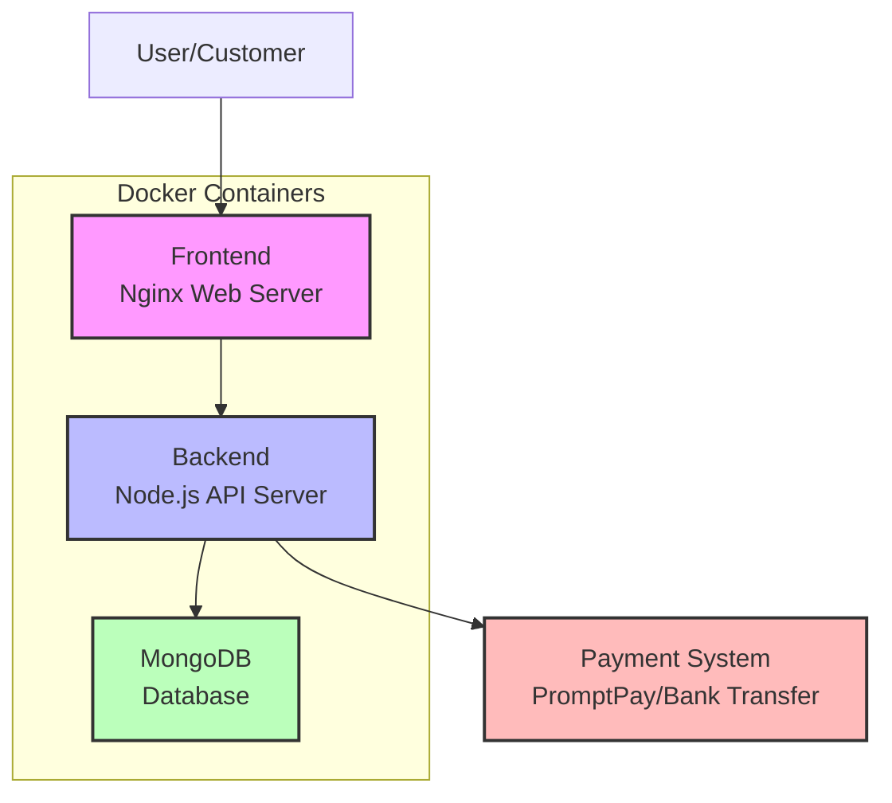

## User Authentication Flow

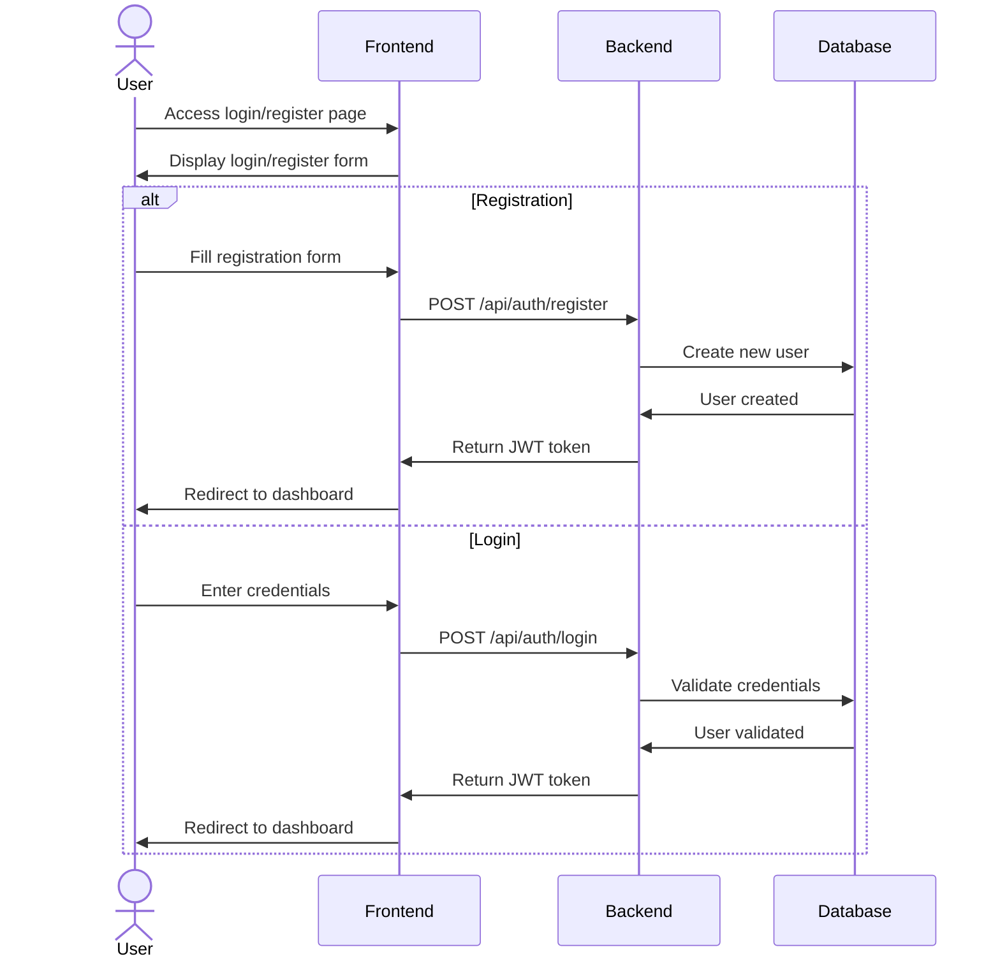

## Shopping Flow

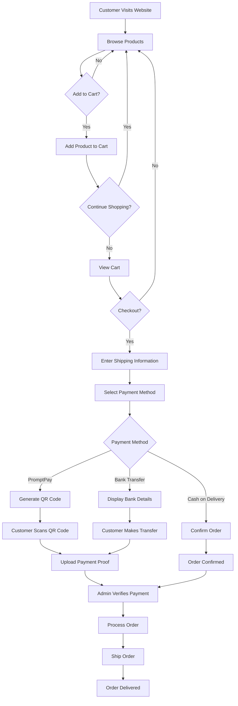

## Order Processing Flow

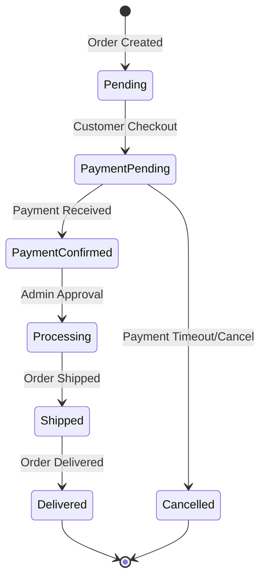

## Admin Dashboard Flow

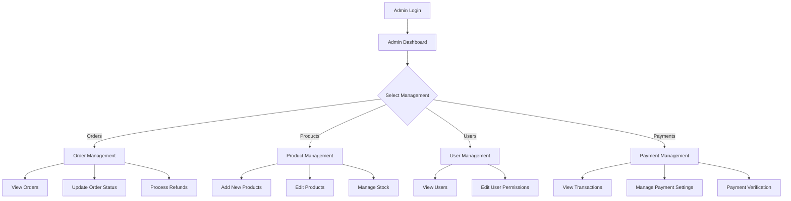

## Payment Processing Flow

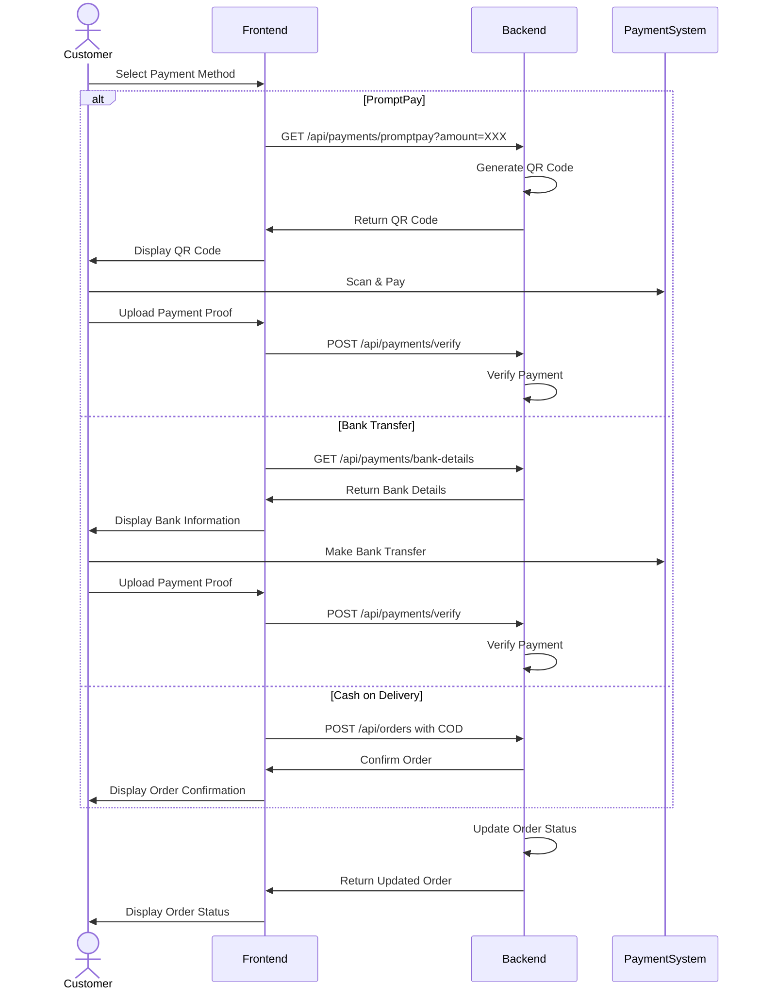

## Data Model Relationships

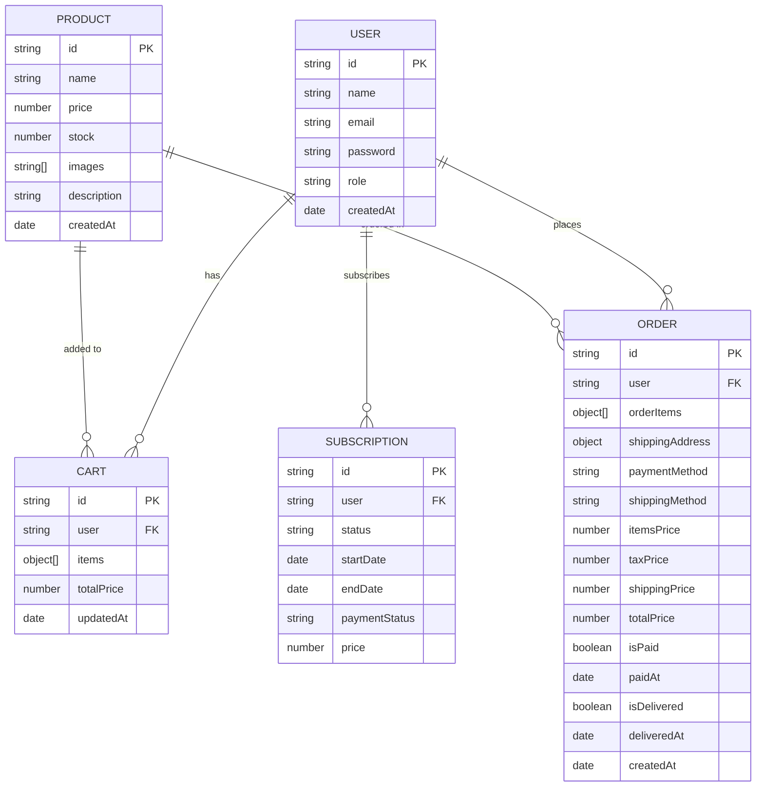

## Cookie Consent Flow

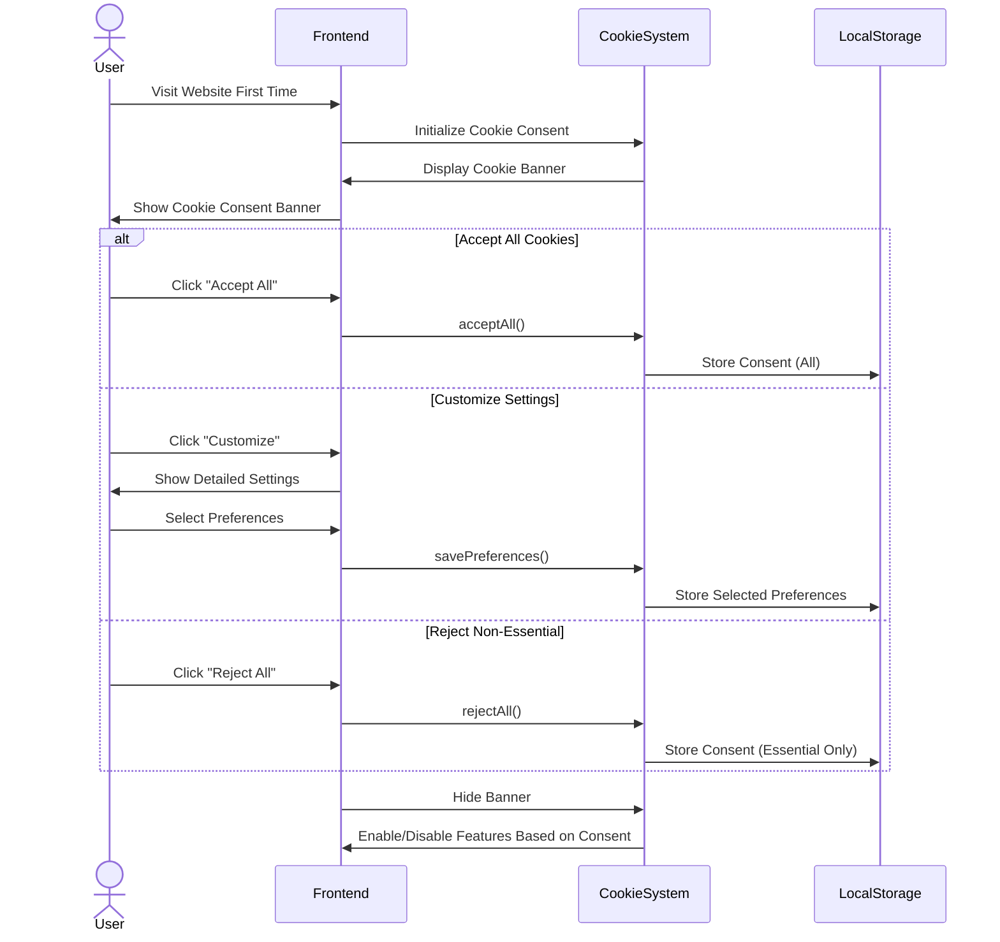

## Docker Infrastructure

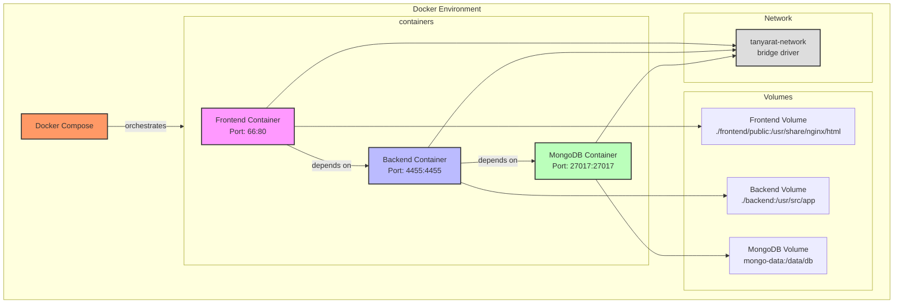

## Dockerfile & Configuration Relationships

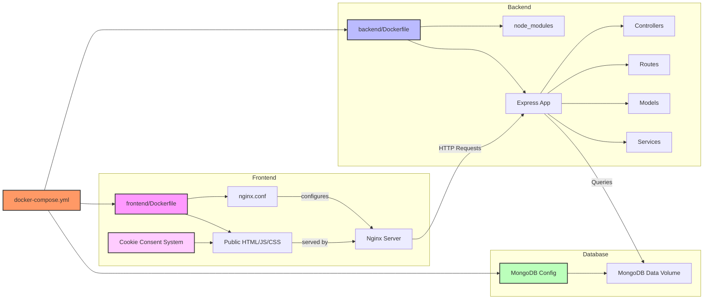

## Deployment Flow

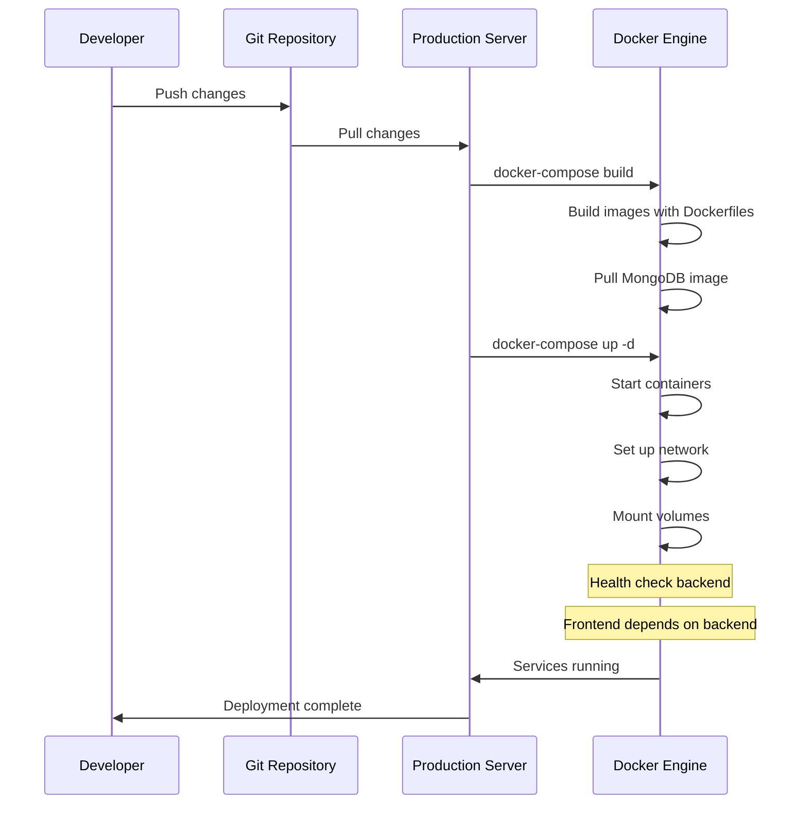

## Cookie Consent Docker Integration

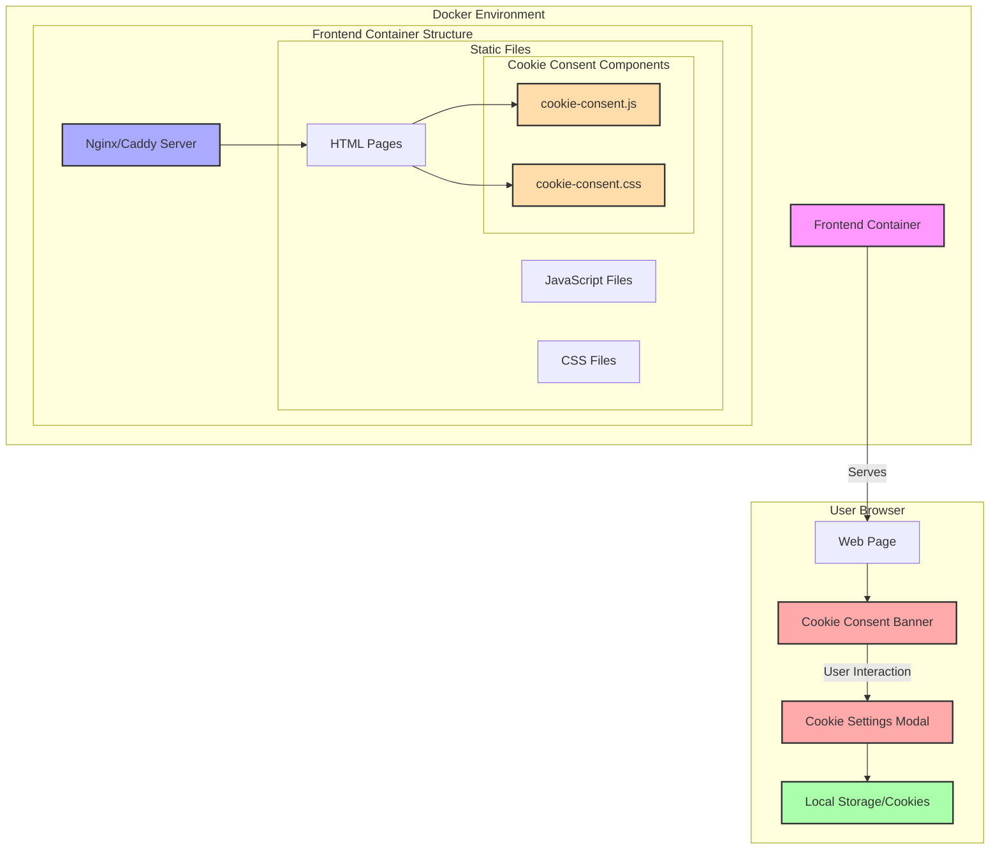